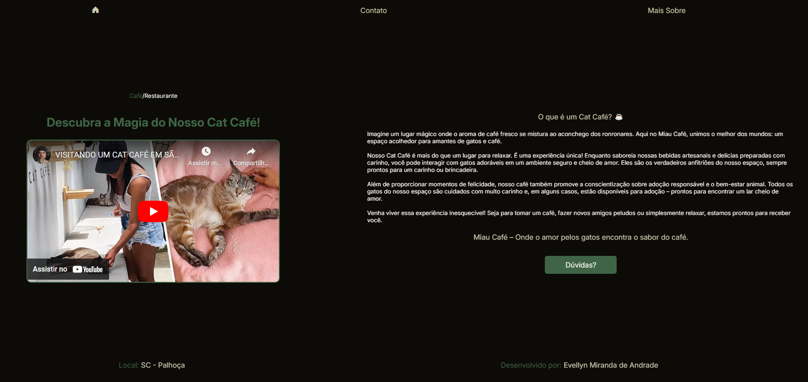

# Miau Café Website

Bem-vindo ao repositório do projeto do site Miau Café! Este projeto foi desenvolvido para criar um espaço online encantador, onde os visitantes podem explorar informações sobre o café, interagir com conteúdos temáticos e encontrar um ambiente virtual que reflete a paixão por gatos e café.

## Sobre o Projeto

O site do Miau Café oferece:

- Uma página inicial com textos convidativos e uma foto do nosso espaço.


- Uma página de contato para poderem tirar suas dúvidas sobre horarios, reserva, adoção, entre outras.


- Uma página mais sobre, com um texto informativo do que é um cat cafe e um video de um cat cafe sendo visitado ao vivo.



## Este projeto foi desenvolvido utilizando as seguintes tecnologias:

- **Front-end:** HTML e CSS

## Pré-requisitos

Antes de clonar o projeto, certifique-se de ter instalado:

- VS code

## Como Clonar o Repositório

1. Abra o terminal ou prompt de comando no seu computador.
2. Navegue até o diretório onde deseja armazenar o projeto.
3. Execute o seguinte comando para clonar o repositório:

```bash
git clone <URL_DO_REPOSITORIO>
```

4. Entre na pasta do projeto:

```bash
cd miauCafe
```

## Como Executar o Projeto

Entre no seu VS code e abra a pasta na qual você clono o projeto e rode o codigo no navegador.

<br>

**Obrigado por explorar o projeto do Miau Café!**
